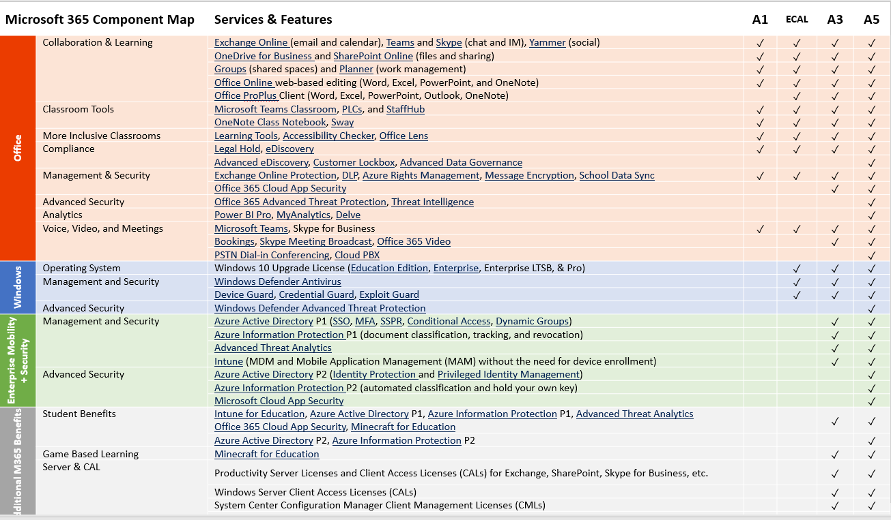

# O365 Log Processing

Contributions are welcome, whether new scripts, documentation, or improvements to existing work. Refer to [CONTRIBUTING.md](CONTRIBUTING.md) for details.

### Table of Contents
1. [Objectives](#objectives)
2. [Common EDU License Types](#common-edu-license-types)
3. [Logs Within Office 365](#logs-within-office-365)
4. [Exporting Logs](#exporting-logs)
5. [Scripts for Log Processing](#scripts-for-log-processing)

## Objectives
- Describe what O365 logs are available per common EDU license types
- Describe how and with what tools the logs can be accessed
- Describe how the logs may be exported to external tools (e.g. SIEM)
- Provide scripts that retrieve log information for specific investigative actions.
- Nurture community-of-practice contributions to sustain and increase the value of this open resource.

## Common EDU License Types

### A1
A1 is the bottom tier, free licenses for Microsoft O365. No additional security tools are available in this tier.

**Note:** Alumni and other "loosely affiliated" populations are typically not assigned A3/A5 licenses (depending on the institution), so it's safe to assume you'll have users at this tier with fewer security tools.

### A3
A3 is the middle tier license for Microsoft O365. A3 includes EMS A3 which adds the following security tools:

* **Azure AD Premium P1**: Secure single sign-on to cloud and on-premises app MFA, conditional access, and advanced security reporting
* **Azure Information Protection P1**: Encryption for all files and storage locations; Cloud-based file tracking
* **Microsoft Advanced Threat Analytics**: Protection from advanced targeted attacks leveraging user and entity behavioral analytics
* **Microsoft Intune**: Mobile device and app management to protect corporate apps and data on any device

### A5
A5 is the top tier license for Microsoft O365. A5 includes EMS A3 (Intune and Advanced Threat Analytics) + EMS A5 which adds the following security tools:

* **Azure AD Premium P2 (includes P1 features)**: Identity and access management with advanced protection for users and privileged identities
* **Azure Information Protection P2 (includes P1 features)**: Intelligent classification and encryption for files shared inside and outside your organization
* **Microsoft Cloud App Security**: Enterprise-grade visibility, control, and protection for your cloud applications
* **Advanced Threat Protection**: Safe Links, Safe Attachments, Phish (spoof) policies
* **Threat Intelligence**: Dashboard of attacks detected against your tenant with easy remediation steps.

### Ad-hoc
Organizations can buy licenses ad-hoc through either their reseller or the Microsoft O365 Admin Portal. Please note that while some features can be enabled for the whole tenant by purchasing only 1 license, this can lead to your tenant not being properly licensed or service degradation. You should only enable the features for the users that you purchased licenses for.

### A1/3/5 comparison chart

## Logs Within Office 365
### Types of logs
* Email Inbound/Outbound
* Safe Links clicks
* DLP Logs
* Azure AD Logs
* Exchange Online Actions
* OneDrive/SPO

**Note**: The Activities API (AKA: Magic Unicorn Tool) is no longer available.[3](#footnote3)

### Log sources
* OCAS - O365 Cloud App Security (formerly known as Advanced Security Management-ASM)
* MCAS - MS Cloud App Security
* Management API
* Powershell
  * Search-UnifiedAuditLog
  * Get-MessageTrace
* Admin Portal
  * Audit log search
  * Message Trace search
  * Safe Links Reports
  * Azure AD
    * Sign-in Logs
    * Audit Logs

### Log Collection Methods available by SKU

| License | OCAS | MCAS| Management API | PowerShell | Admin Portal |
|:---:|:---:|:---:|:---:|:---:|:---:|
|**A1**   | no| no| **Yes** | **Yes** | **Yes** |
|**A3**   | **Yes**[1](#footnote1) | no| **Yes** | **Yes** | **Yes** |
|**A5**   | **Yes**[1](#footnote1) | **Yes**[1](#footnote1) | **Yes** | **Yes** | **Yes** |
|**Ad-hoc**| **Yes**[1](#footnote1) | **Yes**[1](#footnote1) | **Yes** | **Yes** | **Yes** |

### Logs Types available by Collection Method

| Log Type | OCAS | MCAS| Management API | PowerShell | Admin Portal |
|:---:|:---:|:---:|:---:|:---:|:---:|
| Inbound/Outbound mail | no | no | no| **Yes**| **Yes**|
| SafeLinks clicks      | ?  | ? |  ?| **Yes**| **Yes**|
| DLP Logs              | no | **Yes**  | **Yes** | **Yes**| **Yes** |
| Azure AD Logs         | **Yes** | **Yes** | **Yes** | **Yes**| **Yes** |
| Exchange Online Actions| **Yes**  | **Yes**  | **Yes**| **Yes**| no|
| OneDrive/SPO Logs     | **Yes**  | **Yes**  | **Yes** | **Yes**| **Yes** |
| Export predefined alerts to SIEM | **Yes** | ?  | ? | ?| ? |
| Export raw data to SIEM        | no | **Yes**  | **Possible**[2](#footnote2) | **Possible**[2](#footnote2)| no |

## Exporting Logs
### OCAS
#### SIEM Connector
OCAS supports exporting alerts to your SIEM by using the SIEM Connector provided by Microsoft. The connector supports exporting as Generic CEF and Micro Focus ArcSight. Both Splunk and ELK appear to be able to import this format.

### MCAS
#### SIEM Connector
MCAS logs and alerts can be exported using the SIEM Connector provided by Microsoft. The connector supports exporting as Generic CEF and Micro Focus ArcSight. Both Splunk and ELK appear to be able to import this format.

#### PowerShell
You can write custom scripts to query MCAS via PowerShell. Microsoft has provided a PowerShell module to help with querying this data.

### Management API
#### PowerShell
**Note**: that this method can be slow for large tenants. There is a POC that speeds this data collection up and will be shared

Using the Management API, you can write custom scripts to export the data. Microsoft employee blah has written a [PowerShell script](https://github.com/OfficeDev/O365-InvestigationTooling/blob/master/O365InvestigationDataAcquisition.ps1) that allows you to export this data to MySQL, Azure Blob Storage, Azure SQL, JSON or CSV. 

#### Splunk Addon
Splunk provides an add on that will ingest the data for your tenant (from the Management API). The add on is available from the the [Splunk base](https://splunkbase.splunk.com/app/4055/) site. Depending on usage, user counts, and audited events, you can expect ~1 GB/day per 10,000 users.

### Message Trace logs

    Content to be contributed here.

## Scripts for Log Processing

A variety of community-developed scripts are provided, supporting log query and retrieval for specific investigative actions. View the [scripts](scripts) directory

---
---

### Footnotes

<a name="footnote1">1</a>: Requires a license for each user that is being logged. OCAS/MCAS supports scoped deployments now based on Azure AD group.

<a name="footnote2">2</a>: Local scripting & infrastructure development, operations, and maintenance required.

<a name="footnote3">3</a>: Official statement (July 2018) from Microsoft about the Activities API (AKA: Magic Unicorn Tool): 
> Microsoft has always discouraged the use of undocumented APIs, as it can lead to incorrect assumptions, poor user experience or broken functionality. In this case, the particular Outlook Mail REST API referenced and underlying telemetry was built to support service to service communication and does not guarantee the type of complete and accurate activities data that would be necessary to support security investigation scenarios. Following feedback, we are disabling this API.
